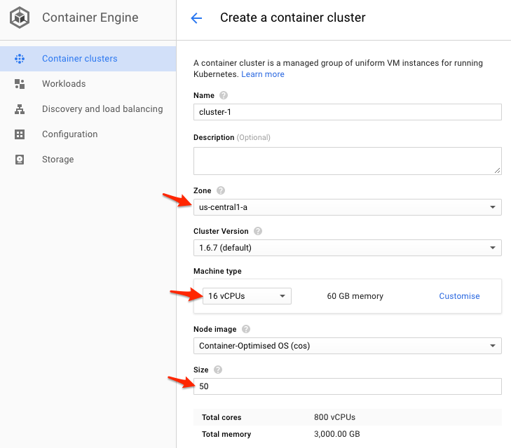
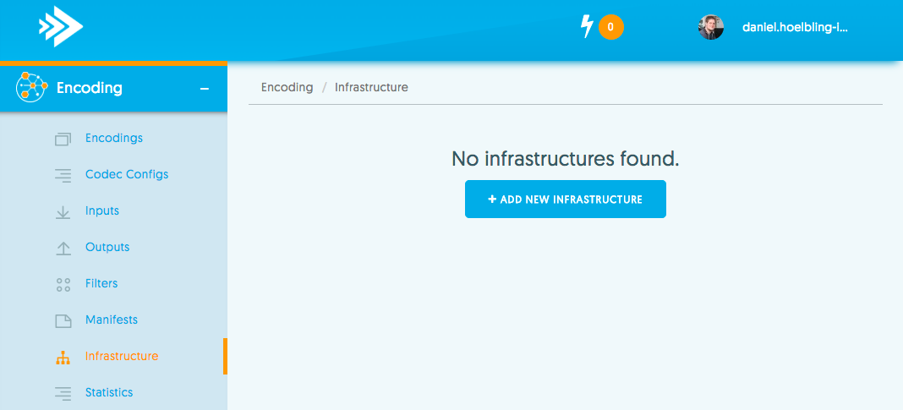
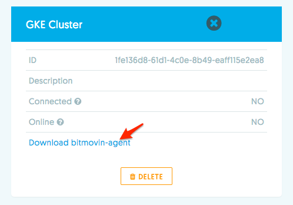
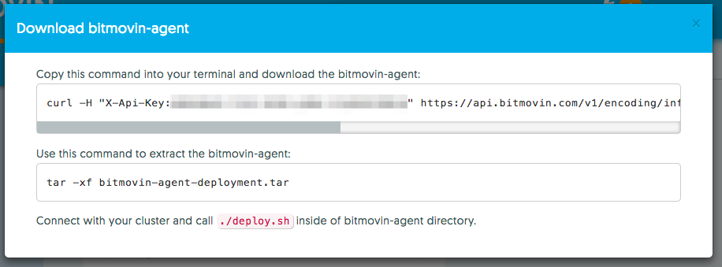

# Connecting a Kubernetes Cluster

Connecting a Bitmovin Containerized Encoding Cluster to the Bitmovin API is pretty straightforward and can be done almost entirely through the UI.

To get started you need to have the Bitmovin Containerized Encoding feature enabled in your account and a running Kubernetes Cluster.

## Starting a Kubernetes Cluster on GKE

Starting a new Kubernetes Cluster in Google Container engine is straightforward and can be easily done through the Google UI.

Go to your [Google Cloud Console Container Engine](https://console.cloud.google.com/kubernetes/list) and click "Create a container cluster"

Enter a Name and select a Zone appropriate for you (usually in the same Zone as your Inputs/Output Buckets). Select a Machine type (we recommend 16vCPUs - `n1-standard-16`) instances and the appropriate amount of instances you need for your workload.



Once the Cluster is started click the `Connect` button to copy the kubectl command to connect to your new Cluster.

Try running `kubectl get nodes` to see if everything is set up correctly on your machine and connected to the cluster.

## Create a External Infrastructure in the Bitmovin API

*__Note__:If you already have a Infrastructure in the Bitmovin API and just want to connect to a new Kubernetes Cluster skip this step*

Go to the [Bitmovin Dashboard Encoding Infrastructure Page](https://dashboard.bitmovin.com/encoding/infrastructure) and click the `Add new Infrastructure` Button.



On the following screen enter a descriptive name for your Infrastructure and click `Create`.

The Infrastructure can be reused for multiple clusters, in case you want to shutdown your Kubernetes cluster when it's not being used. Having multiple infrastructures is only required when you want multiple Kubernetes clusters online and ready to encode at the same time.

## Connecting the Kubernetes Cluster to your Infrastructure

On the [Bitmovin Dashboard Encoding Infrastructure Page](https://dashboard.bitmovin.com/encoding/infrastructure) you can now see your existing Infrastructure and it's status. Since the cluster is not yet connected to the Bitmovin API it will show up as not connected and offline.

Click the `Download bitmovin-agent` Link.



You will see the relevant instructions on how to download an install the Bitmovin Agent on the following screen.



Once this is done you can check with `kubectl get pods` that the bitmovin-agent is now running in your Kubernetes cluster.

After a few seconds the Infrastructure in the Bitmovin Dashboard will also turn green and the Infrastructure will show up as Online and Connected.

## Using the External Infrastructure to encode Videos

To encode Videos on your newly created and connected cluster simply take note of the Cluster-ID and start encodings with the same API Calls you would for a regular Bitmovin Cloud encoding. Just specify the **CloudRegion: External** and your **InfrastructureID**.

```
encodingS := services.NewEncodingService(bitmovin)
encoding := &models.Encoding{
	Name:             stringToPtr("Example Encoding"),
	CloudRegion:      bitmovintypes.CloudRegionExternal,
	InfrastructureID: stringToPtr(`<YOUR INFRASTRUCTURE ID`),
}
encodingResp, err := encodingS.Create(encoding)
```